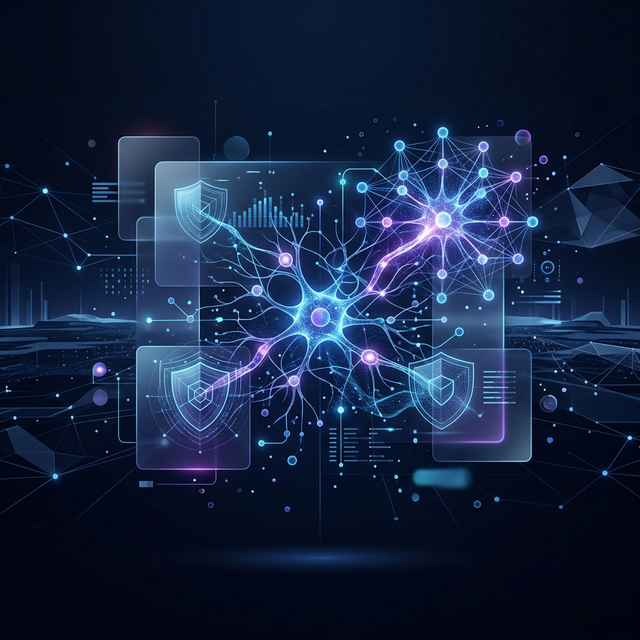
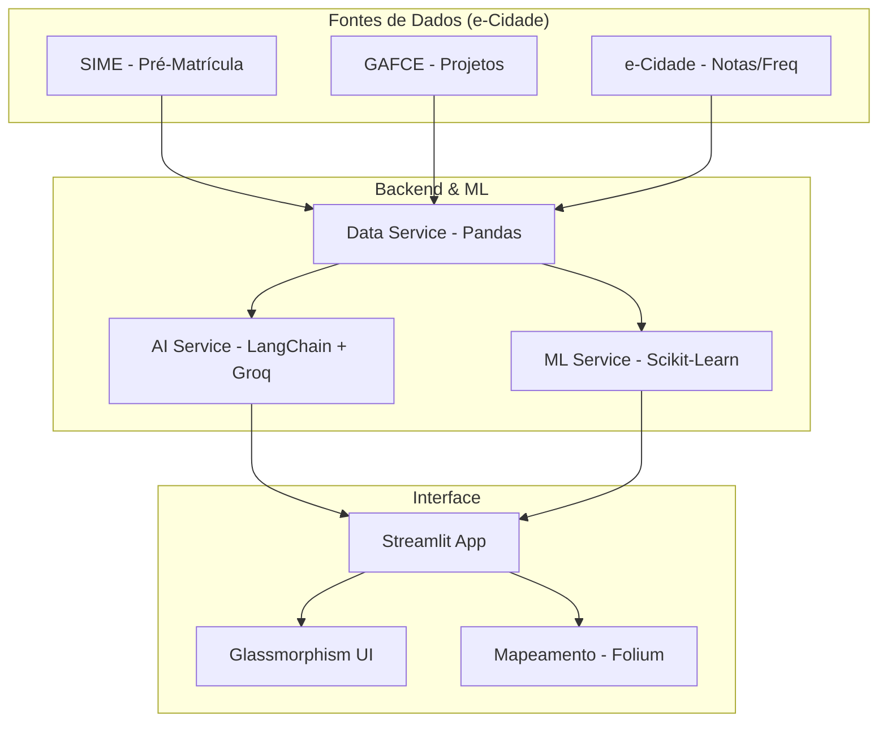
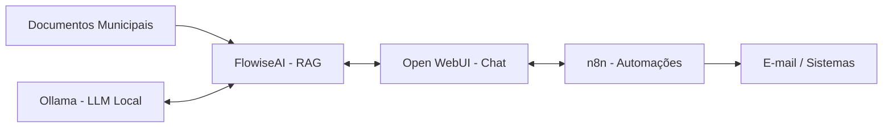
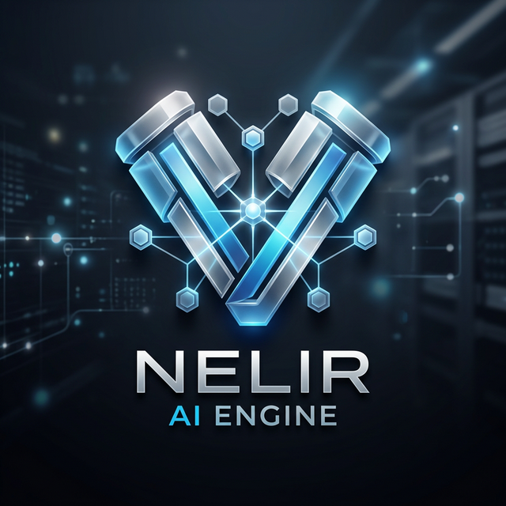

# Rilen T. L. - Data Intelligence & AI Architect 🎲🔍

**25+ Anos de Expertise em TI - Especialista em Big Data, Cloud Architecture & CyberSecurity**

**Rio das Ostras · RJ · Brasil · PcD (Implante Coclear - Foco Deep Work Nativo)**

***Transformando complexidade em insights inteligentes e resilientes.***

  
  
  

---

## 🌎 Idiomas e Acessibilidade

| Idioma | Nível | Badge |
|:---|:---|:---|
| **Português** | Nativo |  |
| **Inglês** | Técnico / Básico |  |
| **Acessibilidade** | PcD (Implante Coclear) |  |

---

## 🧠 Soft Skills & Liderança Estratégica

| Categoria | Competências |
|:---|:---|
| **Gestão** | Mentoria de Equipes · Gestão de Projetos Ágeis (Scrum/Kanban) |
| **Resolução** | Análise Crítica de Dados · Resolução de Problemas Complexos |
| **Estratégia** | Visão de Negócio (BI) · Implementação de Políticas de GRC |
| **Cultura** | Aprendizagem Contínua (Lifelong Learning) · Ética em IA |

---

## ⚒️ Hard Skills (Expertise Técnica Sênior)

| Domínio | Competências Especialistas |
|:---|:---|
| **Engenharia de Dados** | Modelagem Dimensional (Star/Snowflake) · Databricks (Medallion) · ETL/ELT Pipelines · Data Lakehousing |
| **Inteligência Artificial** | IA Preditiva · Fine-tuning de LLMs · RAG (Retrieval-Augmented Generation) · NLP · Visão Computacional |
| **CyberSecurity & GRC** | Hardening de Sistemas · LGPD Compliance · Análise de Vulnerabilidades · Gestão de Risco |
| **Arquitetura & Ops** | Observabilidade Avançada · Serverless Architecture · Microserviços · Infraestrutura como Código (IaC) |
| **Governança** | Qualidade de Dados (Data Quality) · Linhagem de Dados · Catálogo de Dados |

---

## 🛠️ Stack Tecnológica

| Camada | Tecnologias |
|:---|:---|
| **IA & Data Science** |          |
| **Data Engineering** |      |
| **Full Stack & Mobile** |         |
| **Banco de Dados** |      |
| **Infra / Ops / Monitor** |        |
| **Visualização & GRC** |       |

---

# 🚀 Projetos em Destaque

Confira a arquitetura e detalhes técnicos dos meus projetos principais.

---

### 🎓 [eCidade Dashboard | Rio das Ostras](https://github.com/Rilen/eCidadeDash)
> **BI Educacional & IA Preditiva**  
> Solução de inteligência de última geração para a gestão educacional de Rio das Ostras, combatendo a evasão escolar e otimizando o rendimento acadêmico.

#### 🛠️ Stack Técnica & Inovação
*   **Arquitetura de Dados**: Integração de sistemas legados (**SIME**, **GAFCE**, **e-Cidade**) via Data Service reativo.
*   **Inteligência Preditiva**: Algoritmo de *Random Forest* para previsão de risco de evasão e permanência ativa.
*   **IA Generativa**: Assistente (Chat) integrado via **LangChain** e **Groq Cloud** (Llama-3.3) para análise de dados complexos em linguagem natural.
*   **Geoprocessamento**: Mapeamento espacial das unidades de ensino com Folium para análise de distribuição geográfica.

| Camada | Tecnologias |
|:---|:---|
| **IA & Data** |      |
| **Frontend** |    |

---

### 🦪 [OstraIA — Plataforma de IA Municipal](https://github.com/Rilen/OstraIA)
> **Soberania de Dados & LGPD Compliance**  
> Plataforma de IA Open Source desenvolvida para prefeituras, rodando 100% localmente com custo zero de licenciamento.

#### 🛠️ Stack Técnica & Inovação
*   **Privacidade Máxima**: Processamento local via **Ollama**, garantindo que documentos sigilosos e dados de cidadãos nunca saiam da infraestrutura municipal.
*   **Engine de RAG**: Pipeline de *Retrieval-Augmented Generation* via **FlowiseAI** alimentado por leis, decretos e portarias municipais.
*   **Automação de Fluxo**: Integração com **n8n** para triagem automática de protocolos e conexão com e-mail institucional.
*   **Hardware Eficiente**: Otimizado para modelos de alto desempenho como **DeepSeek R1** e **Qwen3:14B**.

| Camada | Tecnologias |
|:---|:---|
| **IA Infra** |    |
| **Modelos** | DeepSeek R1 · Qwen 3 · Llama 3.2 · Mistral |
| **Deploy** |   |

---

### 🚀 [PolyDB Platform](https://github.com/Rilen/PolyDB-Gateway)
> **Unified Data Management & Observability**  
> Simplificação de acesso a múltiplos ecossistemas de dados através de uma camada unificada de Headless CMS.

#### 🛠️ Stack Técnica & Inovação
*   **Directus Headless Engine**: Geração instantânea de endpoints **REST/GraphQL** para tabelas PostgreSQL e MySQL, eliminando a necessidade de wrappers customizados.
*   **Observabilidade Sênior**: Stack de monitoramento integrada com **Prometheus** e **Grafana** para visibilidade total da saúde dos bancos de dados.
*   **Zero-Trust Identity**: Gestão de autenticação e RBAC (Role-Based Access Control) nativa, garantindo acesso seguro a nível de campo.
*   **Orquestração Imersiva**: Deploy modularizado via Docker para independência total do provedor de infraestrutura.

| Camada | Tecnologias |
|:---|:---|
| **API & Admin** |  |
| **Databases** |   |
| **Monitoring** |   |

---

### 🏛️ [OstraSmart: Inteligência Governamental](https://github.com/Rilen/OstraSmart)
> **Blueprint de Inteligência para Gestão Previdenciária**  
> Plataforma avançada construída sobre a API de Dados Abertos do Ostrasprev, transformando dados públicos em decisões estratégicas.

#### 🛠️ Stack Técnica & Inovação
*   **Extreme ETL**: Motor de ingestão assíncrona utilizando **Polars** para processamento ultrarrápido de folha de pagamento e receitas.
*   **Prescritivo & Storytelling**: IA integrada para geração de relatórios em linguagem natural e sugestões de ajustes orçamentários.
*   **Forescasting Crítico**: Modelagem de previsão de despesas previdenciárias através do **Meta Prophet**.
*   **Frontend de Alto Nível**: Dashboard executivo reativo em **Next.js 14** com **TanStack Query** e visualizações dinâmicas.

| Camada | Tecnologias |
|:---|:---|
| **Backend/ETL** |   |
| **Data Science** | Meta Prophet (Forecasting) · Huggingface (NLP Storytelling) |
| **Frontend** |   |

---

### 🧱 [SparkBrick](https://github.com/Rilen/SparkBrick)
> **Crypto Ingestion & Medallion Engine**  
> Motor de ingestão de alto desempenho para APIs de Criptoativos seguindo a arquitetura Medallion com governança via Unity Catalog.

#### 🛠️ Stack Técnica & Inovação
*   **Arquitetura Medallion**: Pipeline completo (Bronze, Silver, Gold) com suporte a **Schema Evolution** e limpeza rigorosa via Spark SQL.
*   **Governança & Linhagem**: Estrutura organizada e auditável através do **Unity Catalog** para controle de acesso refinado e auditoria.
*   **Otimização de Performance**: Implementação de **Z-Order Clustering** (40% ganho em leitura) e regras de qualidade via **DLT Expectations**.
*   **Modern Data Engineering**: Deploy automatizado via **Databricks Asset Bundles (DABs)** para fluxos CI/CD robustos e escaláveis.

| Camada | Tecnologias |
|:---|:---|
| **Python** |   |
| **Big Data** |   |
| **Gov & IaC** |   |

---

### 🌊 [Preve-Ostras](https://github.com/Rilen/preve-ostras)
> **Sistema de Inteligência de Monitoramento Territorial**  
> Painel avançado para pronto atendimento e prevenção de enchentes em Rio das Ostras baseado em dados meteorológicos reais.

#### 🛠️ Stack Técnica & Inovação
*   **Geointeligência**: Integração com APIs de meteorologia (`Open-Meteo`) e dados geográficos do `IBGE`.
*   **Visualização Reativa**: Gráficos dinâmicos com `D3.js` integrados ao ecossistema `React 19`.
*   **Serverless Integration**: Backend escalável utilizando `Firebase` para gerenciamento de dados críticos em tempo real.

| Camada | Tecnologias |
|:---|:---|
| **Frontend** |    |
| **Analytics** |   |
| **Infra** |   |

---

### 🤖 [Nelir AI Engine](https://github.com/Rilen/portfolio)
> **No Bot to Automaton? Much more than that!**  
> Aprendizado Dirigido + Orquestração de LLMs rodando direto no Edge Computing. Um orquestrador de conhecimento sênior integrado ao portfólio.

  

#### 🛠️ Stack Técnica & Inovação
*   **Orquestração AI**: `Gemini 1.5 Flash` para respostas dinâmicas e contextuais.
*   **Edge Architecture**: Implementação 100% Serverless via `Cloudflare Workers` (Runtime V8), garantindo latência zero.
*   **Segurança Robusta**: Secrets management, CORS Hardened e sistema de Fallback Logic resiliente.
*   **Arquitetura de "Deep Work"**: Parametrização focada em 25 anos de TI e acessibilidade (PcD - Implante Coclear).

| Camada | Tecnologias |
|:---|:---|
| **Runtime** |   |
| **AI Engine** |   |
| **CyberSec** |   |

---

### ⚡ [Boostmark](https://github.com/Rilen/boostmark)
> **Inteligência de Marketing & Sales Performance**  
> Ferramenta de profiling e benchmarking para otimização de conversão e análise de performance web.

#### 🛠️ Stack Técnica & Inovação
*   **Web Vitals Profiling**: Ferramenta focada em análise profunda de performance (`LCP`, `FID`, `CLS`).
*   **Estratégia de Conversão**: Insights técnicos para otimização de funis de vendas e marketing digital orientado a dados.
*   **Benchmarking Automatizado**: Comparativo de performance entre diferentes filiais e categorias de produtos.

| Camada | Tecnologias |
|:---|:---|
| **Core** |   |
| **DevTools** |   |

---

### ⚙️ [Pipeline](https://github.com/Rilen/pipeline)
> **Tratamento de Dados & Automação ETL**  
> Pipelines robustos focos em extração e transformação documental com alta disponibilidade e lógica de automação.

#### 🛠️ Stack Técnica & Inovação
*   **ETL Inteligente**: Automação de extração e transformação (`ELT/ETL`) para fluxos de dados documentais robustos.
*   **Alta Disponibilidade**: Arquitetura resiliente para processamento contínuo de dados críticos sem gargalos.
*   **Modularidade Python**: Implementação baseada em `clean code` e extensibilidade para novos conectores de dados.

| Domínio | Tecnologias |
|:---|:---|
| **Engenharia** |   |
| **Workflow** |  |

---

### 🏛️ [Sindi-Fácil](https://github.com/Rilen/sindi-facil)
> **Gestão Sindical Digital & GRC**  
> Ecossistema para administração de condomínios, focando em transparência, auditoria de portaria e segurança de dados.

#### 🛠️ Stack Técnica & Inovação
*   **Segurança de Identidade**: Autenticação robusta e controle de acesso hierárquico (`RBAC`) via `Firebase Auth`.
*   **GRC Rooted**: Arquitetura desenhada para conformidade com `LGPD` e auditoria administrativa completa.
*   **Serverless Ops**: Persistência de dados escalável e reativa com `Firestore` para notificações instantâneas.

| Camada | Tecnologias |
|:---|:---|
| **Ecosistema** |   |
| **Serverless** |   |

---

### 🌱 [IrrigaSeca](https://github.com/rilen/IrrigaSeca)
> **Agro-Tech: IoT & MLOps**  
> Sistema de irrigação inteligente com telemetria via MQTT e modelos preditivos de umidade de solo.

#### 🛠️ Stack Técnica & Inovação
*   **MLOps Aplicado**: Modelos de regressão (`scikit-learn`) integrados para predição de umidade baseados em tipo de solo.
*   **IoT & Telemetria**: Protocolo `MQTT` para controle de hardware em tempo real com baixa latência em campo.
*   **Eficiência Hídrica**: Otimização de recursos através de inteligência preditiva, reduzindo desperdícios na agricultura.

| Domínio | Tecnologias |
|:---|:---|
| **IA/Data** |   |
| **Telecom** |   |

---

### 📊 [xlsx2chart](https://github.com/Rilen/xlsx2chart)
> **BI Automatizado: Excel to Insights**  
> Conversão dinâmica de planilhas complexas em dashboards interativos sem necessidade de software pesado.

#### 🛠️ Stack Técnica & Inovação
*   **Data Democratization**: Transformação instantânea de arquivos legados (`XLSX`) em ativos visuais intuitivos.
*   **Zero Heavy-Software**: Execução 100% *client-side* (`Vanilla JS`), garantindo privacidade total dos dados do usuário.
*   **Dashboards Dinâmicos**: Lógica de parsing otimizada para lidar com massas de dados variadas em tempo real.

| Núcleo | Tecnologias |
|:---|:---|
| **Engine** |   |

---

### 📿 [RezarSempre](https://github.com/Rilen/RezarSempre)
> **Android Moderno & Devocional**  
> App focado em UX e Acessibilidade, utilizando as últimas tendências do Android Jetpack.

#### 🛠️ Stack Técnica & Inovação
*   **Accessibility First**: App desenhado com foco em acessibilidade profunda (`WCAG`), integrando Material You.
*   **Android Jetpack Moderno**: 100% desenvolvido com `Jetpack Compose`, `Coroutines` e arquitetura reativa `MVVM`.
*   **Experience Imersiva**: Integração com `Media3` para uma experiência de oração áudio-visual fluida e contínua.

| Plataforma | Tecnologias |
|:---|:---|
| **Mobile** |   |
| **Core** |   |

---

## 📈 Atividade & Estatísticas

  

---

## 🎯 Próximos Passos (Backlog)

- 🏛️ **Ecossistema OstraSmart**: Implementação de modelos Meta Prophet e integração total com Huggingface.
- 🏗️ **IA Generativa Local**: Expansão do OstraIA com suporte a novos modelos (O3-Mini/Llama-4) e maior escalabilidade via GPU.
- 📱 **Acessibilidade Profunda**: Evolução de apps Android focados em UX inclusiva para deficientes auditivos (PcD).
- 🔐 **Federated Learning**: Pesquisas em análise de dados sensíveis preservando a privacidade na cloud.

---

  Transformando 25 anos de experiência técnica em soluções inteligentes e futuristas. - Todos os Direitos Reservados | 2026

